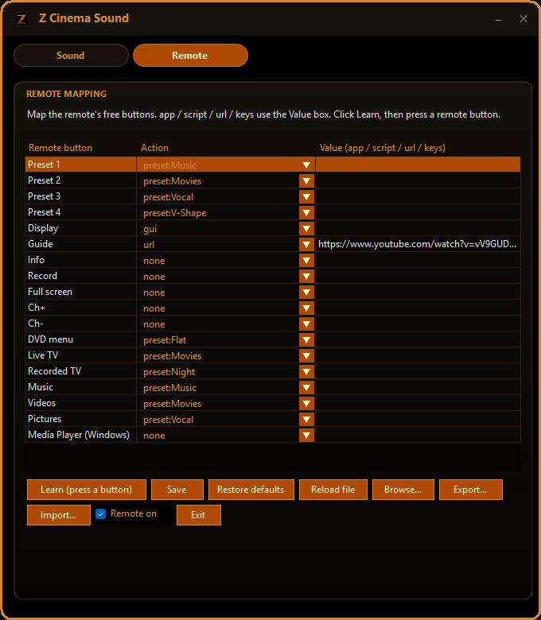

# ZCinema Sound

<p align="center"></p>

> **Current app:** the native **C#/.NET** build in `src-app\` is the primary
> product — a themed tray app with the 8-band EQ, a Windows volume slider,
> ceiling calibration and remote-button mapping. The **PowerShell scripts below
> are legacy/reference** (they still work) and are kept until the `.exe` reaches
> full parity. See [Native app (C#)](#native-app-c).

## Native app (C#)

The current app lives in `src-app\` (`ZCinemaSound.Core` + `ZCinemaSound.App` +
`ZCinemaSound.Tests`). It needs the [.NET 10 SDK](https://dotnet.microsoft.com/) to build.




### Install (recommended)

Download **`ZCinemaSound-Setup.exe`** from the
[latest release](https://github.com/Hydraxon91/zcinema-sound/releases).

- **Equalizer APO is required** (GPLv2 — not bundled). The installer detects it
  and, if missing, opens its download page and waits for you to install it, then
  click **Retry** (or Cancel to abort).
- After setup, open **Equalizer APO's Device Selector**, tick
  **Speakers (Z Cinéma)**, click OK, then **reboot** so the effects attach.
- The installer is **unsigned**, so SmartScreen may warn ("More info → Run anyway").
- The same release also ships the portable **`ZCinemaSound.App.exe`** (no installer).
- **Smaller download?** **`ZCinemaSound-Setup-lite.exe`** is framework-dependent and
  needs the [.NET 10 Desktop Runtime](https://dotnet.microsoft.com/download/dotnet/10.0)
  (the installer checks for it). Use the regular `ZCinemaSound-Setup.exe` if you'd
  rather not install the runtime.
- The installer asks whether to install **for all users** (admin, into Program Files)
  or **for me only** (no admin, into `%LocalAppData%\Programs`).

### Build from source

```powershell
cd src-app
dotnet build
dotnet run --project ZCinemaSound.App      # run it
dotnet test                                # unit tests
```

Single-file, self-contained `.exe` (no runtime needed on the target):

```powershell
dotnet publish ZCinemaSound.App -c Release -r win-x64 --self-contained true `
  -p:PublishSingleFile=true -p:IncludeNativeLibrariesForSelfExtract=true
```

The tray menu has **Install / update profile**, **Bypass processing** and
**Uninstall** — so the app manages the Equalizer APO wiring itself (no legacy
scripts needed; install/uninstall self-elevate).

It shares the same profile (`…\EqualizerAPO\config\ZCinema.txt`) and the same
`%APPDATA%\ZCinemaSound\` data as the legacy scripts, and uses the same
single-instance mutex — so **don't run both at once**.

Tuning is kept **per output device**. With two or more devices configured, the app
writes Equalizer APO one `If` block per device (matched by endpoint GUID) with an
`Else` fallback to the active device's profile, so every device keeps its own sound
and audio can never go silent. Prefer one global profile? Turn off **Per-device EQ
scoping** in the tray menu.

Sound profile + setup helper that makes the **Logitech Z Cinéma** USB speakers
sound right on modern Windows (10/11) — proper volume behaviour, bass, treble
and EQ — **without any kernel driver and without test-signing**.

It is a thin wrapper around [Equalizer APO](https://sourceforge.net/projects/equalizerapo/)
(GPLv2), which does the actual audio processing.

## Why this exists

The Z Cinéma is a ~2007 2.1 USB speaker set (`USB\VID_046D&PID_0A0F`). Windows
has always detected it fine (inbox `usbaudio`), but:

- the volume slider feels "maxed out" around 40 %, and
- the original Logitech/SRS tone controls (TruBass, TruSurround HD, bass/treble,
  dialog clarity) no longer exist, because the 2007 driver can't install on
  modern Windows.

This project fixes both in user space. No driver, no signing, safe for
kernel-level anti-cheat (EAC/BattlEye/Vanguard).

## What you get

| Feature | How |
|---|---|
| Volume that stays in sync | Windows' own volume everywhere (remote, OSD, media keys, per-app). `Preamp` sets the ceiling. |
| Bass / Treble | Broad peaking bands, used like a bass/treble control (a shelf is not used because this Equalizer APO build ignores `LSC`/`HSC`) |
| EQ | Parametric bands (edit text or use the Peace GUI) |
| TruSurround-ish width | Stereo crossfeed (`Copy:` lines) |
| Dialogue clarity | ~3 kHz presence boost |
| Live GUI | The app's **Sound** tab (Bass, Treble, Dialogue, Width, ceiling + 8-band EQ); legacy equivalent: `legacy\tools\ZCinema-GUI.ps1` |
| Tray app | The GUI **hosts the remote bridge** and lives in the notification tray: closing hides to tray, double-click/Open restores it, **Exit** quits. Optional **Start with Windows** (tray menu). |
| Presets | Flat / Music / Movies / Night / Vocal / V-Shape (with EQ), plus 3 savable Custom slots |

## What you don't get

Straight about the limits:

- **No real SRS TruSurround HD.** The stereo widener here is an approximation of
  the surround staging, not the patented algorithm. (The 2007 SRS APO DLL does
  load on Win11, but it can't be attached to the audio endpoint without a signed
  driver package — and even then it's unproven on the modern engine.)
- **No SRS treble / definition controls.** The original SRS software exposed
  extra treble-style controls (Definition, Dialog Clarity). Here treble is a
  single wide peaking band — similar in effect, but not the SRS processing.
- **No access to the speaker's own bass and treble.** The Z Cinéma's built-in
  bass/treble — the controls you reach under the volume (on the remote, or in the
  original Logitech panel) — live in the speaker's firmware. Software cannot read
  or move them. The GUI's Bass/Treble sliders are a separate layer added on top.
- **No true surround.** The hardware is 2.1 (two satellites + sub). There is no
  rear-channel simulation or multichannel decode — only stereo widening.
- **No ASIO / WASAPI-exclusive processing.** Equalizer APO is a shared-mode
  system effect; apps that take the device in exclusive mode bypass it.
- **No room correction.** The EQ is manual — no measurement mic, no auto-tuning.
- **Not stored on the device.** Settings are per-PC (an Equalizer APO config).
  On another PC, a console, or Bluetooth, the sound is stock.
- **No kernel driver, by design.** Good for anti-cheat, but it also means no
  driver-level hooks or vendor control-panel integration; nothing is test-signed.
- **Remote extras aren't implemented yet.** Media keys work inbox; the vendor HID
  collection (`FFBC:0088`) is unused so far. A user-mode remote bridge is planned
  — see `legacy\tools\Remote-Probe.ps1` and `docs\ROADMAP.md`.
- **Not a signed app.** It ships as an unsigned single-file `.exe` (once
  packaged) or PowerShell + Equalizer APO today; SmartScreen may warn on first run.
- **Anti-cheat caveat.** Equalizer APO is user-mode and widely used with games,
  but no anti-cheat guarantees anything — and you can disable it any time with
  `src\Bypass-ZCinema.ps1`.

## Requirements

- Windows 10/11, 64-bit
- [Equalizer APO](https://sourceforge.net/projects/equalizerapo/) installed
  (you install it yourself — it is **not** bundled here, to respect its GPL and
  to keep this repo free of third-party binaries)
- The Z Cinéma connected

## Legacy PowerShell toolkit (unsupported)

The native app above is **the product**. The original PowerShell toolkit is kept
only as a reference/regression harness and now lives under **`legacy\`**
(`legacy\ZCinema.bat`, `legacy\launchers\`, `legacy\src\`, `legacy\tools\`,
`legacy\config\`, `legacy\presets\`). It is **not maintained**, and it shares the
same profile and single-instance mutex as the app — **don't run both at once**.
See `legacy\README.md`.

The app's control panel is a **tray app** that also runs the remote bridge, so
your mapped remote buttons work while it's open. It starts in the tray — open it
from the tray icon (or with the **Ctrl+Alt+0** hotkey). The tray menu has a
**Presets** submenu (quick switching), **Manage custom slots…**, **Bypass
processing**, **Show window on start**, **Global hotkeys**, **Back up / Restore
settings…**, **Check for updates…** and more.

## Install (legacy PowerShell only)

You don't need this if you used the installer above. From `legacy\`:
`legacy\src\Install-ZCinema.ps1` (admin) copies `legacy\config\ZCinema.txt` into the
Equalizer APO config folder and points `config.txt` at it. The old GUI is
`legacy\tools\ZCinema-GUI.ps1`, calibration is
`legacy\tools\Calibrate-Ceiling.ps1`, and removal is
`legacy\src\Uninstall-ZCinema.ps1`. Your previous `config.txt` is backed up beside
it as `config.txt.bak-<timestamp>`.

## Volume, explained

Do **not** use a custom volume curve — it desyncs the Windows UI. Instead:

- Leave Windows volume as your everyday control. The Z Cinéma's remote volume
  keys drive it natively, so everything stays in sync.
- `Preamp:` in the config lowers the overall level so that **100 % equals your
  comfortable maximum**. If the speakers "max out" at ~40 %, a preamp around
  −8 to −13 dB makes the whole slider usable again.

The app's **Calibrate ceiling** button (or the legacy
`legacy\tools\Calibrate-Ceiling.ps1`) measures the endpoint's real dB taper and
tells you the exact preamp to use.

## Uninstall

Use the app's tray menu → **Uninstall** (or Windows *Apps & features*). To remove
the legacy PowerShell wiring instead, run `legacy\src\Uninstall-ZCinema.ps1`
(keeps a backup of `config.txt`).

## Layout

```
src-app/                          the product (C#/.NET 10)
  ZCinemaSound.Core/              profile model, presets, per-device store, HID decode, updater
  ZCinemaSound.App/               WinForms tray app (Sound + Remote tabs)
  ZCinemaSound.Tests/             xUnit tests
assets/    ZCinemaSound.ico/.png  app + README artwork (8-size icon pack)
installer/ zcinema.iss            Inno Setup script (+ build-installer.ps1)
docs/      ANTI-CHEAT, TROUBLESHOOTING, PRESETS, REMOTE-CODES, PORTING, ROADMAP
legacy/    PowerShell/.bat toolkit (unsupported reference) — see legacy/README.md
```

The Equalizer APO profile the app writes lives at
`…\EqualizerAPO\config\ZCinema.txt`; your data (device profiles, remote mappings,
custom slots, settings, backups) lives in `%APPDATA%\ZCinemaSound`.

## Icon


Palette: `#010001` (major), `#D9872C` / `#AE4906` (accents), `#E1E0E1` (edge),
`#FAFBCA` (very minor). `assets\ZCinemaSound.ico` is an 8-size pack
(16/24/32/48/64/96/128/256) used for the window and tray icon, with a system-icon
fallback if it's missing.

## Credits / legal

- Audio engine: **Equalizer APO** by Jonas Thedering (GPLv2) — not included here.
- Not affiliated with, or endorsed by, Logitech or SRS Labs. "Logitech",
  "Z Cinéma" and "TruSurround"/"TruBass" are trademarks of their owners and are
  used descriptively.
- This repo contains **no** Logitech/SRS binaries and requires none.
- Our code: MIT (see `LICENSE`).
